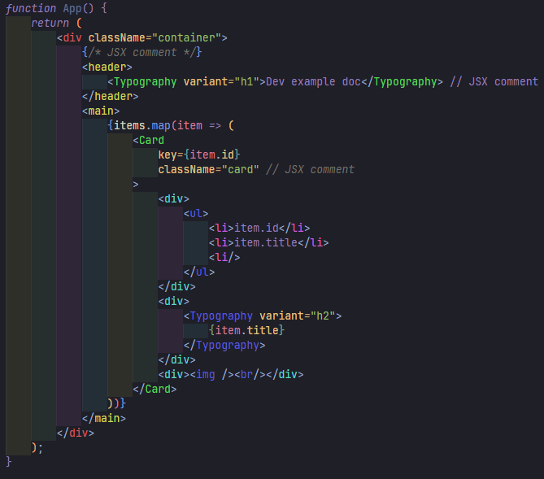

# 🎨 Colored Tags

A VS Code extension that colors HTML/JSX/TSX etc. tag names based on their nesting level for better code readability.

## Features

- 🏷️ Colors tag names (opening, closing, and self-closing tags) based on nesting depth
- 🌈 Distinct colors for each nesting level (rotating hue)
- ⚡ Optimized for performance with debouncing and file size limits
- 🔄 Automatically updates as you type
- 🎯 Supports HTML, XML, JSX, and other similar languages (maybe)

## Supported Languages

- HTML
- XML
- JavaScript (JSX)
- TypeScript (TSX)
- Vue
- And any other language with HTML/XML-like tags (maybe)

## How It Works

The extension analyzes your code in real-time and assigns a unique color to each nesting level:



## Installation

1. Go to the [Open VSX](https://open-vsx.org/extension/tazalov/colored-tags) and download the extension (`.vsix` file).
2. Open Visual Studio Code.
3. Press `F1` or `Ctrl+Shift+P` (Windows/Linux) or `Cmd+Shift+P` (macOS)
4. Type and select *"Extensions: Install from VSIX..."*
5. In the file explorer that opens, navigate to the location where you downloaded the `.vsix` file.
6. Select the file and click *"Install"*.
7. Wait for the installation to complete. Once finished, you will see a notification confirming that the extension has been installed.
8. Reload the extension if needed (see Commands below).

## Usage

The extension activates automatically for supported file types. Tag names will be colored immediately.

### Commands

- `Refresh Tag Colors` - Manually refresh tag colors (useful if colors get out of sync)

### Performance Features

- **Debounced updates**: Colors update 300ms after you stop typing
- **File size limit**: Files larger than 100KB are skipped for performance

## Configuration

You can customize the following settings in your VS Code `settings.json`:

```json
{
    "coloredTags.maxFileSize": 100000,        // Max file size (bytes)
    "coloredTags.updateDelay": 300,         // Debounce delay (ms)
}
```

## Requirements

- VS Code 1.60.0 or higher

## Known Issues

- Very large files (>100KB) are skipped by default
- Complex template literals in JSX might not be fully supported

## Contributing

Found a bug? Have a feature request? [Open an issue](https://github.com/tazalov/vscode-colored-tags/issues)

## License

MIT

---

**Enjoy!** 🎉